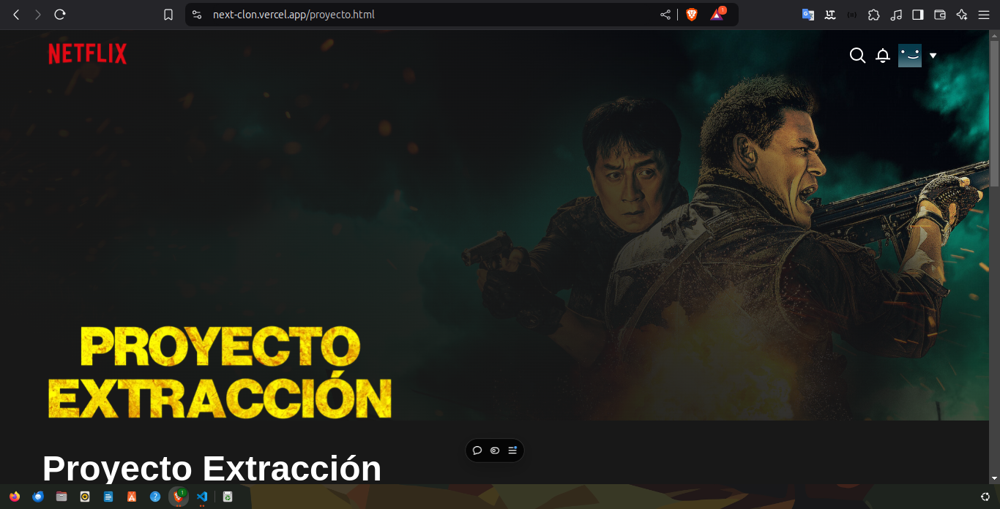

# Proyecto de Clon de Netflix

Proyecto realizado por Keyner de la Hoz, [Link del proyecto desplegado](https://next-clon.vercel.app/)

## Puntos importantes del proyecto

- En la página principal del proyecto, va a aparecer un input el cual, al llenarlo y darle clic al botón, lo va a redirigir a la página de registro (ese registro no es funcional).


- En la barra de navegación de la página principal se encuentra un botón, el cual lo redireccionará a la página de inicio de sesión, para que llene los datos. Para ingresar a la cuenta, el correo y la contraseña son los siguientes:
    <br/>
    **Correo:**
    ```
    keynerdelahoz@gmail.com
    ```
    <br/>

    **Contraseña:**
    ```
    123456
    ```
    

    En caso de que ingrese mal los datos, el borde de los inputs cambiará automáticamente a rojo, como se muestra a continuación:
    

- Luego de iniciar sesión correctamente, nos lleva a la página de inicio del catálogo de las películas. Más abajo, en las películas **Favoritas**, una de las cartas tiene el efecto de sobresalir del resto; al poner el cursor sobre ella, el efecto aparecerá:
    

- Al lado de la carta con el efecto de sobresalir, está una carta la cual, al seleccionarla, lo llevará al detalle de la misma.
     

- Entrando en esta página, si se le da clic al ícono de la película, se empezará a reproducir el tráiler de la película:
    

- Al final de las páginas está el footer, el cual tiene un select con las diferentes categorías.
    

Gracias.
